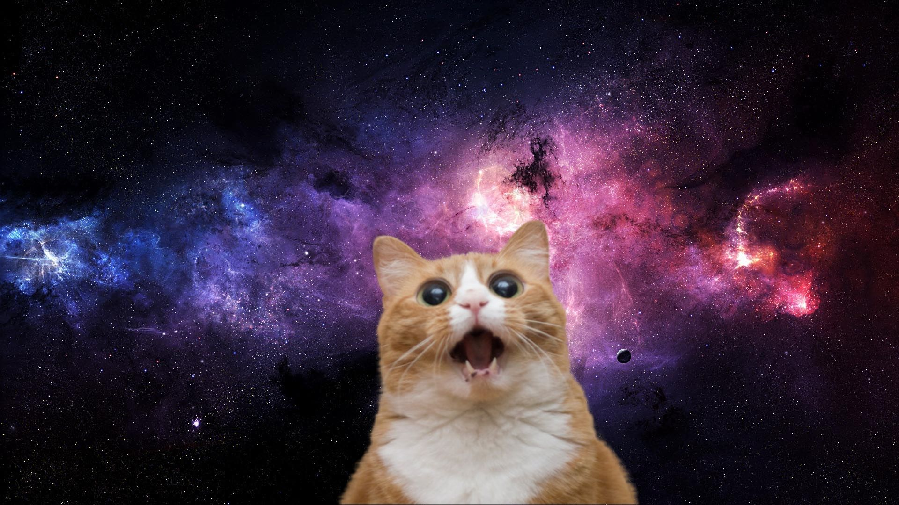

# Инструкция к языку MarkDown

## Выделение текста 

Что бы написать текст курсивом, необходимо обрамить его звёздочками или нижним подчёркиванием. Например: *курсив* или _курсив_

Что бы выделить текст полужирным, необходимо обрамить его двойными звёздочками или двойным нижним подчёркиванием. Например: **полужирный** или __полужирный__

Альтернатиыные спосоы выделения текста нужны для того что-бы мы могли совмещать два этих способа. Например: **_текст может быть выделен курсивом и быть полужирным_**

## Списки 

## Работа с изображениями 

Что-бы вставить изображение в текст необходимо сделать следующее: 

## Цитаты 

## Ссылки 

## Работа с таблицами 

## Заключение 
